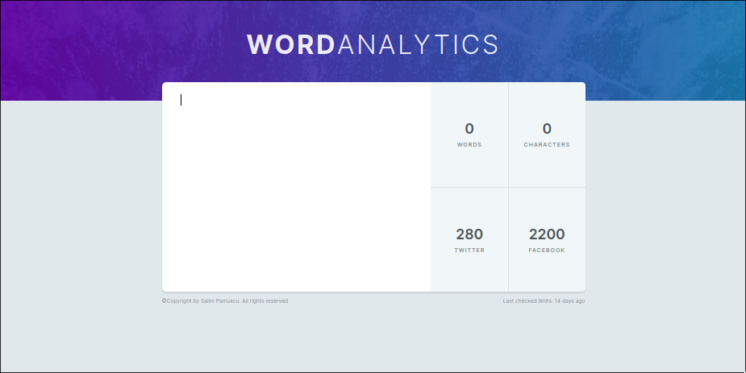

# WORD-ANALYTICS

This is word analytics web app with Javascript, html & css as a learning project.

## Getting Started

In the project directory run

### `npm i`

## Available Scripts

In the project directory, you can run:

### `npm exec live-server`

Runs the app in the development mode.\
Open [http://localhost:8080](http://localhost:8080) to view it in your browser.

The page will reload when you make changes.\
You may also see any lint errors in the console.
